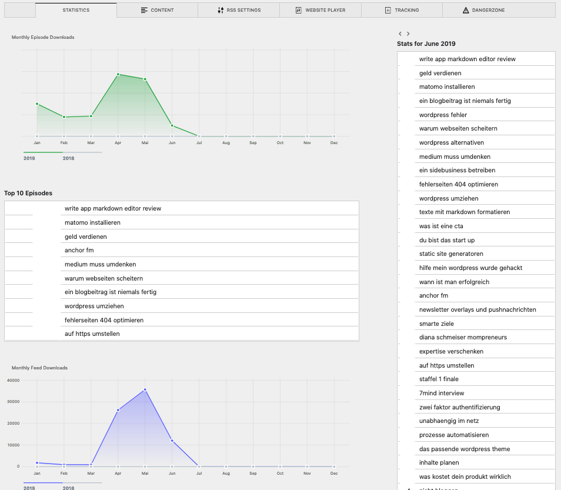
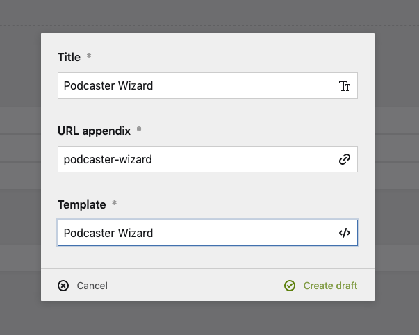
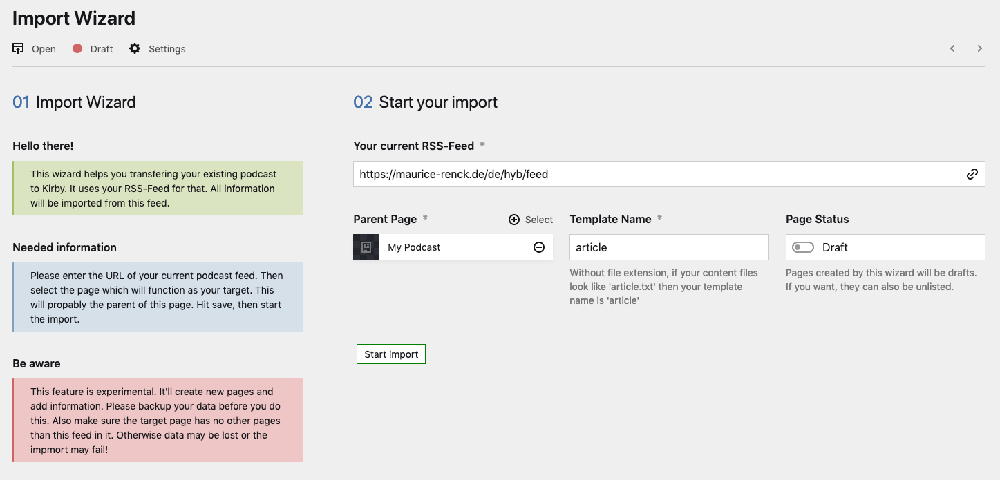

# Kirby Podcaster

  

**A Kirby 3 Podcast Plugin**

This plugin helps you running your own podcast with Kirby 3. It uses all the new panel-features to make your life easier. You can run multiple podcasts and configure them in the panel. All new iTunes specifications are included and chapters are supported. It creates iTunes/Google/Name-Your-Favorite-Podcatcher Feeds and allows you to track downloads of your episodes and hits on your feeds. It comes with two Audioplayers, a simple html5-audio-player and the advanced Podlove-Player supporting things like chapters, cover and much more. Or you can use your own player, if you wish.

## New: Statistics
You can now see your download stats in the panel. This currently works only, if you're using the mysql option:




## Features

* ✅ Import wizard, move your existing podcast to kirby
* ✅ Panel blueprint section for episodes
* ✅ Panel blueprint for extended RSS feed (including all new iTunes specifications)
* ✅ Run multiple podcasts with just one Kirby installation
* ✅ Podcast Chapters
* ✅ Cover image per feed **and** episode
* ✅ Snippet for a simple HTML5-Player
* ✅ Snippet for the advanced Podlove Player
* ✅ Configure and style your website player within the panel
* ✅ Tracking of episodes/feeds using Kirby and the episode markdown
* ✅ Tracking of episodes/feeds using Kirby and MySQL
* ✅ Tracking of episodes/feeds using Matomo
* ✅ Tracking of episodes using PodTrac
* ✅ Statistics view in Panel
* ✅ Prefill fields from your ID3 data


### Changelog

* 2019-07-25 - Podcaster Wizard, import your existing podcast into kirby
* 2019-07-24 - New Apple Podcast Categories

## Installation

- `composer require mauricerenck/podcaster`
- unzip [master.zip](https://github.com/mauricerenck/kirby-podcaster/releases/latest) as folder `site/plugins/kirby-podcaster`
- `git submodule add https://github.com/mauricerenck/kirby-podcaster.git site/plugins/kirby-podcaster`

## Move your existing Podcast to Kirby



1. In the panel create a new page. Name it however you want, select the template `Podcaster Wizard`. After the page is created, open it in the panel.
2. Enter your current feed url, select the target page. Below this page all episodes and the feed will be created. Make sure there are no other pages within your target page, otherwise the import may fail.
3. Enter the template that should be used for your episodes. If your content files look like `article.txt` your template name i `article`.
4. You can now decide if the episodes should be created as draft (default and recommended) or unlisted. 
5. Hit the `Start import` button and lean back.



**Please do not close the wizard page, or the import will be interrupted and fail**

After the import is finished, you should delete the import wizard page, you don't need it anymore.

## Start from scratch

### Create RSS-Feed
Log into the panel and go to the folder containing your podcast episodes. Add a new unlisted page and name it `feed` using the template `podcasterfeed`. Please note that there is a problem, the template currently doesn't appear in the template list, so you have to add or change it by hand, naming the markdown-file `podcasterfeed`. The feed can then be edited in the panel.

Fill in all needed information.

If you want you can give your feed another name, you then need to change the download-trigger, see below in the tracking-settings.

### Add episode tab to your blueprint

If you're using the panel you may want to edit the episode specific information in your article blueprint. You can do so, by adding a new tab using the blueprint `tabs/podcasterepisode` this could look like this:

```
tabs:
    content:
        label: Your sections and columns
        icon: text
    podcast:
        extends: tabs/podcasterepisode
```

If you never used tabs before, have a look here: https://getkirby.com/docs/guide/blueprints/tabs

You can now edit your episode as needed by iTunes and other directories.

### Create an episode
1. Create a new page for your episode.
2. Open the podcast tab.
3. Start with setting the episode type.
4. Upload your mp3 file

Podcaster will try to parse the ID3 data of your mp3 (if there is any) and fill out fields like the title, subtitle, description and chapters. This is a bit buggy in the panel. **To let the panel know that there is new data, please reload the page after uploading your file, then revert any changes.** The imported data will then be visible and you can edit the rest of the fields.

To disable this feature set `mauricerenck.podcaster.setId3Data = false` in your config.php

### Tracking

Kirby Podcaster allows you to track the downloads of your episode and your rss-feed. There are three main tracking options available:

1. Internal tracking
2. Matomo (Piwik)
3. PodTrac

You can combine those methods as you want.

**NOTE**
Downloads can currenly be tracked, but there are no visual stats in the panel, yet.

### Enable internal tracking

To use the internal tracking, activate it in your `config.php` file by setting:
```'mauricerenck.podcaster.statsInternal' => true```

### Tracking of episodes
Tracking the downloads of your episodes requires a route with a certain keyword which functions as a trigger. The default keyword is `download`. Within your feed the URLs will be automatically set to match this keyword. If you want to use another keyword, you can set it in your `config.php`

```'mauricerenck.podcaster.downloadTriggerPath' => 'trackdownload'```

### Tracking of feed downloads
If you want to track your rss-feed, you have to set the slug of your feed in the `config.php`. If your feed url is `https://podcast.tld/myfeed/` set:

```
'mauricerenck.podcaster.defaultFeed' => 'myfeed',
```

Default value is `feed`, so if you name your rss-feed-page `feed` everything is find and you don't have to do anything.

### Tracking Mode
You can either use the file method, then your downloads will be directly stored in your episode markdown file. Note that this *can* lead to problems if there are a lot of simulatiously downloads. You may run better by using the mysql method:

```
'mauricerenck.podcaster.statsType' => 'mysql',
'mauricerenck.podcaster.statsHost' => 'HOSTNAME',
'mauricerenck.podcaster.statsDatabase' => 'DATABASE',
'mauricerenck.podcaster.statsUser' => 'USER',
'mauricerenck.podcaster.statsPassword' => 'PASSWORD'
```

If you want to use the file method, set 
```'mauricerenck.podcaster.statsType' => 'file'```

**ATTENTION!**

Before using the MySQL statistics please make sure to create the tables within your database. You can find the SQL import in the `res` directory of this repository called `podcasterStats.sql`


## External tracking with matomo
To make sure Kirby Podcaster can access your Matomo API, you must set these to values in your config.php

```
'mauricerenck.podcaster.matomoToken' => 'my-secret-token',
'mauricerenck.podcaster.matomoBaseUrl' => 'https://my-matomo-url.tld/'
```

You can enable download tracking via Matomo for each feed. Go to your feed settings and click on the Tracking tab. Fill in all needed values.


## External tracking with podtrac
Just log into the panel, go to your feed and enable podtrac in the tracking-tab.


## Add Player to template

There are two players available.

1. The standard html5 player
2. The advanced podlove player (https://podlove.org/podlove-web-player/)

You can chose which player to use in the player-settings of your feed.

If you want an audio player appear on your episode page, just add the follow snippet to your template: `<?php snippet('podcaster-player'); ?>`

If your feed isn't a sibling of your episodes and you selected another source in your rss-settings, you can hand in the episode page and the feed page like so: `<?php snippet('podcaster-player', ['page' => $episodePageObject, 'podcast' => $rssFeedPageObject]); ?>`

This could be also handy, if you want to show the player in your podcast listing.

If you want to use the PodLove-Player and style it, you can try around here: https://docs.podlove.org/podlove-web-player/theme.html


## OpenGraph
You can add an opengraph entry for your episodes in your page header. This will automatically embed an audioplayer when for example linking in medium.com or facebook. You can just add the og-snippet anywhere between `<head></head>`

```<?php snippet('podcaster-ogaudio'); ?>```
