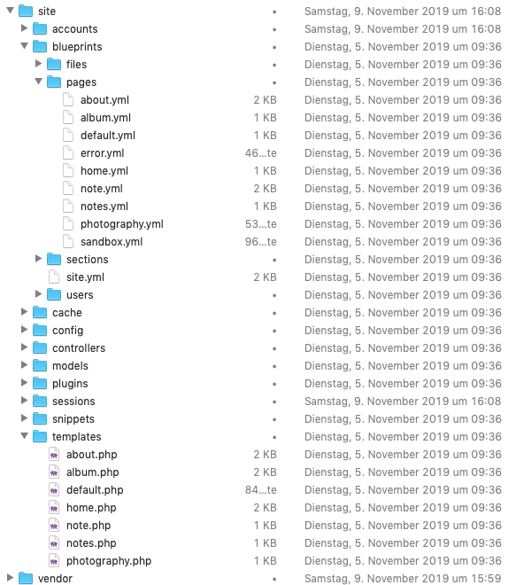
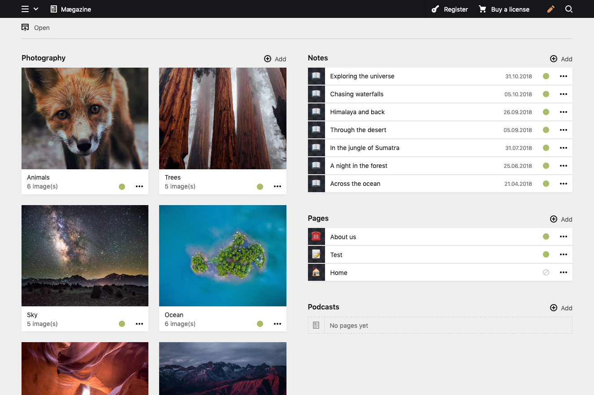
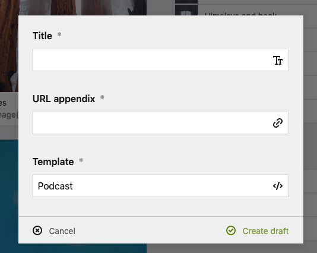
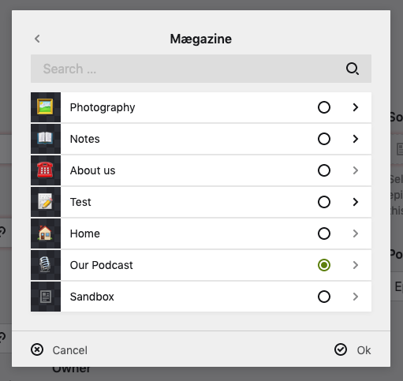

# Using Kirby Podcaster with the Kirby Starterkit

## Step 1 - Install Kirby

If you haven’t already install the Kirby Starterkit. You can find infos on how to do so here: https://github.com/getkirby/starterkit

## Step 2 - Install Podcaster Plugin

You can in stall the plugin in three different ways:

1. via composer (recommended) `composer require mauricerenck/podcaster`
2. via zip file
   download [master.zip](https://github.com/mauricerenck/kirby-podcaster/releases/latest)
   unzip it and move it to `site/plugins/kirby-podcaster`
3. via git `git submodule add https://github.com/mauricerenck/kirby-podcaster.git site/plugins/kirby-podcaster`

## Step 3 - Setting up the structure

The Starterkit has three types of content available for you. The albums, you can find as „Photography“ in the panel. The notes, which act as simple blog posts. And some pages.

Thats unfortunately not enough for our podcasting setup. We need a new Type of page, which can be added to the menu and which will contain all episodes and the feed of our Podcast. In the end the structure within `content` should look like this:

    1_photography
    2_notes
    3_about
    4_our-podcast/
    	feed
    	20180126_episode
    	20180127_episode
    	20180128_episode

As you can see the podcast as some child pages, the feed, which is hidden and three episodes with a timestamp as leading number so they are sorted by date and not manually. As we don't only want to show the episodes in our feed, we also need a template for our website, so they are listed there, too.

## Step 4 - Get the blueprints ready

The way the Starterkit ist configured, you can only use certain templates on certain pages. To be able to use the Podcaster blueprints, we have to add them to the list of allowed templates. To do so, we have to look into the blueprint folder, open the file explorer or terminal of your choice and go to: `site/blueprints`.



As you can see you will find blueprints for all the pages, we saw in the panel (and some more which aren't interessting for us now). In addition to the blueprints there also are the according templates.

> **Note: You can find all the files of this tutorial in the assets folder.**

### Adding a space for our podcast(s)

In the panel we want to have a place for all our podcasts. We want to be able to create a new Podcast which then can contain a feed and its episodes, which should be sorted by date.

#### Podcast blueprint

We begin by creating a blueprint for a podcast in `site/blueprints/pages` and name it `podcast.yml`. You can have a [look at the file here](assets/blueprints/podcast.yml). I won't go into detail here, just some short notes. If you use that blueprint and create a new page with it, you will see three sections, published, unlisted and drafts.

Published will contain all the published episodes, unlisted will contain our feed and drafts can contain what ever you want it to ;)

When you look at the blueprint, you may notice two things in the published section, which are important:

`sortBy: date desc`

which will disable manual sorting and sort the episodes by date

```
        template:
          - episode
          - podcasterfeed
```

Which will limit the pages we can create to the feed and single episodes. If also want to show other things, like blog posts, you have to extend this (and change the feed template).

#### A space for our Podcasts

We could now create a Podcast but there is still no place for it in the panel. We're not able to select our newly created template, so we will create a new place for that. For that open the `site.yml` blueprint. Add the following code block at the end of the file:

```
      podcasts:
        type: pages
        template:
          - podcast
          - podcasterwizard
```

Always make sure the code is intended the right way, otherwise it will cause errors. In this case `podcasts:` should be on the same level as the `pages` part in the file. You can [see a sample here](assets/blueprints/site.yml)

Reload the panel and you should see the new section for our podcasts:



Great, click on Add and you should be able to create a new page with the podcast blueprint or the wizard.



#### Creating our first podcast

**Before we start:** _The Podcaster plugin comes with a wizard, which can help you transfer an existing podcast. So if you already run a podcast you can use that tool. I will describe how to do that later on. You then don't need to create all the pages described here, but you still need the blueprints and templates._

We will start to create a new page choosing the Podcast template. After creating it, you will see the new page with the three sections we created before. Now change the status of the page to `Unlisted`. This is important for the next step.

#### Creating the feed

First we need to create the rss feed. Within the new podcast page, create a new draft, name it `feed` and select the `Podcaster Feed` Template.

You will see a lot of fields you need to fill out. Let's start with the `Source Page`. Click on Select, you should be able to see our Podcast page we created the step before. Select it and click OK.



Fill out all the other required fields as they fit your Podcast. We will ignore the other tabs for now.
Set the status of the feed from `Draft` to `Unlisted`. You should now be able to open it and see your empty feed. 🎉

#### Creating episodes

To be able to create an episode we need a blueprint for that, too. So let's create one in `blueprint/pages` and name it `episode.yml`. You can [find the code here](assets/blueprints/episode.yml).

Some notes on the blueprint: You may need some more fields for your site. I just added an intro, text and date field. Add as many other fields as you wish.
Have a look at the last two lines of the blueprint:

```
  podcast:
    extends: tabs/podcasterepisode
```

This will add a new tab to the page where you can fill out all the episode relevant fields. And where you can upload you mp3 files.

After creating the blueprint we can go to the panel and open our podcast page.
Add a new draft and choose the episode template.
You can now start filling out all the fields, upload you mp3 file and save it. Then change the status to `Published`.

Open the feed in your browser, it should now show the first episode! If not make sure the date is not in the future and you uploaded an audio file.

**Congratualiation you can now submit your feed to iTunes and all the other plattforms and start podcasting!**

## Step 5 - Showing the Podcast on our own site

We just created the blueprints for the panel and are now able to submit our feed which may be all you need, but maybe you'll want to show the episodes on your website, too. For that we need some templates.

### The Podcast template

This template will show the list of all episodes which are published. We'll steal from the notes template here and modify it a bit, so it fits our needs.

Create a new file in `site/templates` and name it `podcast.php` have a [look at my sample here](assets/templates/podcast.php).

It's nearly the same template which comes for the notes but you will note one big change:

```
<?php
      foreach ($page->children()->listed()->filter(function ($child) {
          return $child->date()->toDate() <= time();
      })
        ->filter(function ($child) {
            return $child->hasAudio();
        })
        ->sortBy('date', 'desc') as $episode):
?>
```

So what is happening here?

We're getting all the child pages (episodes) which are listed. This way we prevent to also list the rss feed. We then start filtering the result.

First we filter out all the pages which publish date is in the future. This way we can create episodes, publish them and set the date to the future. On the given day and time they will appear as new episodes. Before that date and time, they will be ignored (the rss feed does the same).

After that we will filter out episodes which do not have an audio file. We don't want them here. _Note: If you wish to also show blog posts here, you'll need to remove that part_

Finally we're sorting the episodes by date, the newest one should be on top.

### The episode template

For the single episodes, we want to show the intro, text and also a fancy web player. For that we need to create another template, name it `episode.php`. You can [find it here](assets/templates/episode.php). Again we're stealing from the note template.

We will slightly modify it, as you may have noticed. First of all, we also want to show the intro. After that we want to show a web player and then the more detailed text.

For that we added the following line:

`<?= $page->intro()->kt() ?>`

Which will render our intro.

After that we want to add a player. Kirby Podcaster will enable you to choose one of two player:

1. The default html5 audio player which is very basic but works in every modern browser without javascript
2. The Podlove Web Player, which support cool things like chapters, looks really good and comes with all the features you may whish to have.

In our template we do not have to decide which player to use, we just all the following snippet:

`<?php snippet('podcaster-player'); ?>`

That's it!

#### Configuring the player

We can now switch to the panel and start configuring the player. This is done in the feed settings. So open the feed in the panel and select the `Webplayer` tab. On the left you can select the player type, on the rigt you can set colors and some other configs. What ever you set here, will appear on the episode details.

## Finishing up

That's it! We're now able to podcast, submit our feed and show episodes on our website!
You can do a lot more, you can enable tracking of downloads via the plugin and matomo or podtrack. Please look at the readme for more details on that.

All we have to do now, is to publish our podcast page. Open it in the panel and switch the status from `unlisted` to `published`. That's it! You're live! Look at your website, you new podcast should appear in the main menu.

If you have another podcast, just create a new page with the podcast template, create the feed and episodes. All the settings for the player and tracking will be done per podcast/feed.

## Importing an existing podcast

The Podcaster plugin comes with an import wizard which enables you to transfer any existing Podcast to Kirby. You will still need to create all the blueprints and template, but you don't need to create all the pages. So start by creating those blueprints and templates. Then go to the panel.

In the podcast section create a new page. Use the Podcast template. This will be the base for your podcast. Set the status to `unlisted`. That's it for now

Create another page in the section and choose the Wizard template. Name it like you wish, we will delete it afterwards.

Fill in the feed url of your existing podcast. Select the Podcast page you just created in before as the `Parent Page`. Use `episode` as your template name.

Everything correct? Hit the `Start import` button. You will see some status messages. The wizard will try to parse your feed and get the needed information. It will then start parsing your episodes, create them in kirby, download the mp3 files and upload them to kirby, too! It will also create the base for your rss-feed.

** DO NOT CLOSE THE WINDOW!**

After everything is done, you can go the podcast page. You should see all your pages as drafts and also a new rss feed. You will need to adjust the feed. You can edit the episodes or just change their status to published.

That's it! You're ready! Publish the page and change the feed url wherever you submitted it or redirect the old one to the new one.

We can now just delete the wizard page, we don't need it anymore.
