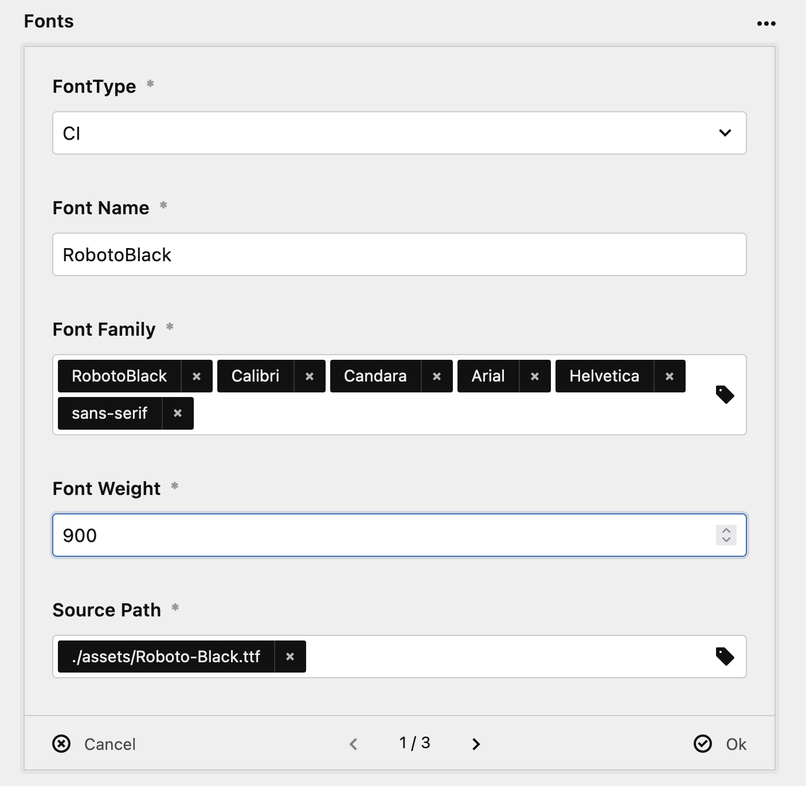

# Setting up the Webplayer

To embed a player into your site you can use a simple snippet coming with the Podcaster plugin:

```
<?php snippet('podcaster-player', ['page' => $page]); ?>
```

The rest of the setup can be done in the panel.

## Player Setup

Podcaster comes with two types of players:

1. A simple HTML5 audio player
2. The Podlove player

The HTML5 player does not have any options to configure. Simply choose it as your preferred player, the snippet above will do the rest.

### Podlove player

The [PodLove player](https://podlove.org/podlove-web-player/) is a mighty one and allows you to configure it in detail.

#### Colors and fonts
You can define colors and fonts to make the player match your design. Simply add an entry for the color or font, choose an option and add fill in the fields. 



#### Active tab
You can define a tab to be opened by default. Simply select to tab you want to be opened from the select field.

#### Clients 
When users click on the subscribe button of the player, you can define, which services should be listed. There is huge list of those services, simply select the one you want to add. 

There are some services which need some additional information you have to fill in the `Service` input field. Right now those are:

- Apple: https://podcasts.apple.com/podcast/[service]
- Derer: https://www.deezer.com/en/show/[service]
- Google Podcasts: Your feed url
- Pocket Casts: Your feed url
- Soundcloud: https://soundcloud.com/[service]
- Spotify: https://open.spotify.com/show/[service]
- Stitcher: https://www.stitcher.com/podcast/[service]
- YouTube: https://www.youtube.com/channel/[service]

Most of the the time the `[service]` placeholder is the Id of your podcast on the platform.

#### Sharing
You can also define which channels for sharing should be available in the sharing tab of the player. Simply select the ones you like.

If you want to enable the user to not only share the Podcast or episode but also the current position within the episode, you can enable the `Share Playtime` feature.

