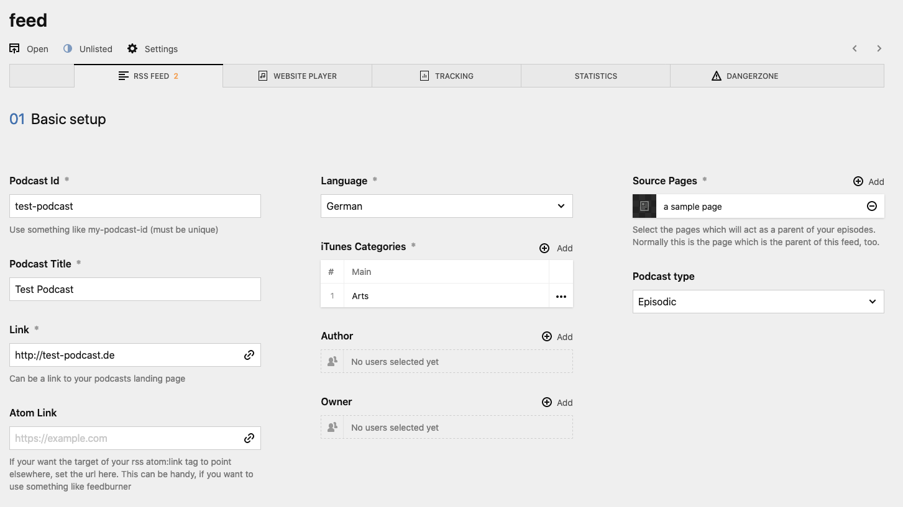
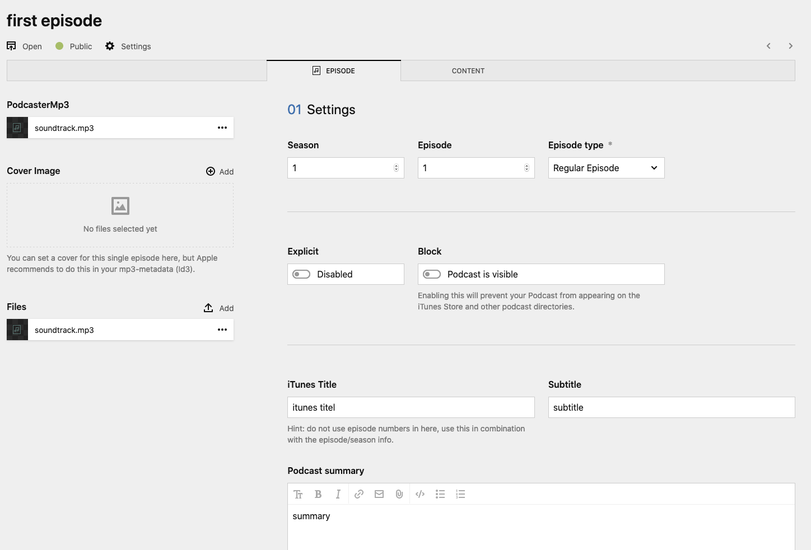
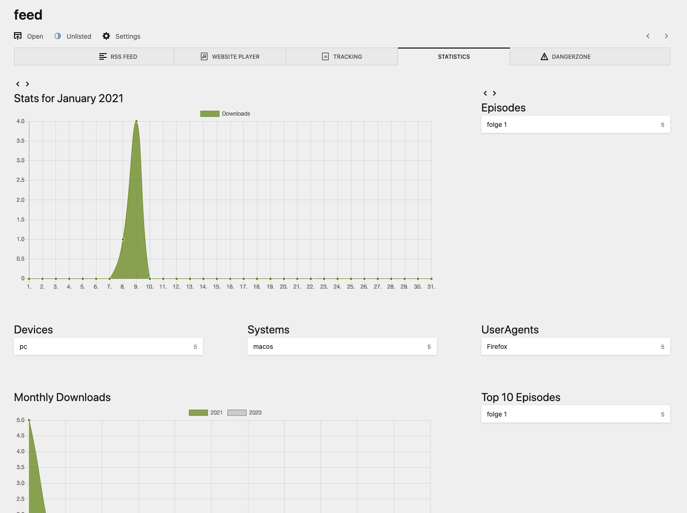

# Installation and base configuration

## Installation

Start by installing the plugin. You can install it in three different ways. It's recommended to use composer, but not needed.

- `composer require mauricerenck/podcaster`
- `git submodule add https://github.com/mauricerenck/kirby-podcaster.git site/plugins/podcaster`
- unzip [master.zip](https://github.com/mauricerenck/kirby-podcaster/releases/latest) as folder `site/plugins/podcaster`

## File structure of your podcast

Before setting up everything, you should think about the file structure of your Podcast setup. There are two recommended ways to set it up:

### Structure 1: Flat structure

```
YourPage
    |____ Your Podcast
            |____ feed (unlisted)
            |____ episode 1
            |____ episode 2
```

### Structure 2: Grouped by season

```
YourPage
    |____ Your Podcast
            |____ feed (unlisted)
            |____ season1
            |       |____ episode 1
            |       |____ episode 2
            |____ season2
                    |____ episode 1
                    |____ episode 2
```

As you can see, there should be a single page for your Podcast containing the feed and the episodes. With **structure 2** we're adding some subpages for each season. The `Your Podcast` page should be some sort of listing template you can create on your own as you need. With **structure 2** the season pages should have a similar listing template. _Note that you cannot just list all child pages when going for structure 2_. There will be some samples below.

You should decide _now_ which structure you are going to use, as I will reference those two options in the upcoming steps.

## Setting up your Podcast in the panel

Even though it is possible to set up your Podcast using only markdown files, I would recommend using the panel as it comes with some handy helpers for categories and things like this.

### Blueprints

Using structure 1 or structure 2 you need some blueprints to be able to create fitting pages in the panel:

1. A listing blueprint
2. An episode blueprint
3. A rss feed blueprint

Podcaster comes with some blueprints for pages, tabs and sections which you can use.

#### Listing blueprint

I won't write a lot about this blueprint, as there are no rules or resistricions here. You must be able to add child pages, so you can add the feed and episodes or sublistings.

#### Episodes blueprint

This blueprint functions as your episode detail page, if you have a blog it may look a lot like you blogpost blueprint. The rss feed get the episode data from here. This plugin comes with a _tab blueprint_ you should use for this. In addition to this, you episode also needs a datefield named `date`. This is not part of the podcaster episode tab blueprint as it might conflict with existing page blueprints being extended.

```
tabs:
  content:
    label: Content
        [...]
        date:
            type: date
            label: Publishing date
            time: true
  podcast:
    extends: tabs/podcasterepisode
```

[Here is an example of such a blueprint](assets/blueprints/episode.yml).

#### RSS Feed Blueprint

This is the most complex blueprint and you don't have to write it on your own as it is part of this plugin.

### Creating the pages

We can now start building one of the structures above. Create a page with the listing blueprint. When want to use structure 2 you also have to add a subpage for first season. Then create the page for the feed.

#### RSS Feed

Create a new page, title it `feed` and choose the Template `Podcaster Feed`.

You should now see a new panel page with a lot of tabs and fields to fill. Don't worry, to start we just have to fill some of the fields and can finetune the rest later on.



Start by typing your podcast id, this should be a string without spaces (like an url slug) to identify your podcast, it must be unique and not be reused for a second podcast.

The podcast title should be pretty obviouse, this is the name of your podcast.

Add a link to your podcast, this might be the url to the listing page we just created.

Choose the spoken language and select matching Apple Podcast Categories. First choose the main then the sub category.

The **source pages** are very important. Select the pages which act as the parent of your episodes. If you chose structure 1 this is the main listing, if you chose structure 2, this is the season listing. Whenever you add another season listing you also add it as a source here!

That's it for now. Save it and switch the status from `unpublished` to `unlisted`.

#### An Episode

Let's create an episode. Create a new page next to the feed (or if you chose structure 2 in your season subpage). Select the episode blueprint you created before and select the `EPISODE` Tab.



I won't go into detail here, because things should be pretty clear.

You have at least to select an episode type, which can be a regular episode, a trailer or a bonus. If you want enter season data and set a special Podcast title, subtitle and summary. If your podcast is very long you can also add chapters, your listeners can then jump to that timestamped section if their player supports chapters (the podlove player we're using in the template does).

Of course you need to upload your mp3 file. You can add a special cover image for that episode, but that's not recommended, you better use ID3 tags instead. Speaking of Id3:

You can enable the Id3 detection in your config file `site/config/config.php` by setting `'mauricerenck.podcaster.setId3Data' = true`. You can then upload your mp3 file and the plugin will try to parse the Id3 data, it will then fill out fields like the Podcast title.

Don't forget to set a publish date and time, or the feed won't show your episode. It will automatically ignore episodes with a date in the future, so you can plan and create your pages up front and they'll appear in the feed as soon as their publish date is reached.

**That's it!** You could now submit your feed to all the directories out there. They won't be visible on your site because we still don't have any templates.

## Creating Templates for the frontend

Good news first: There is a template for your feed, you don't have to do anything for that.

You still have to create a template for your listings and your episode pages. Please have a look at the [samples here](assets). Be aware! If you chose structure 2, you need to do some adjustments here! Use `index()` instead of `children()` as your episodes are no direct children of your main listing.
And the player snippets needs another path to your rss feed, too. Use something like this: `<?php snippet('podcaster-player', ['podcast' => $page->parent()->parent()->find('feed')]); ?>`

### Website player

Speaking of the player. You can embed two kinds of player on your site. The default HTML5 player which can play your audio nothing more. Or the podlove player which as a lot of nice functions, like chapters. You can just use the `<?php snippet('podcaster-player'); ?>` snippet and then select a player in your feed settings. In the panel open your feed, click on the website player tab and select the player type. You can also fine tune the podlove player if you wish. That's it!

Your Podcast should now also be available on your website. Hurray!

## Seeing who is listening

If you want some numbers, you should enable tracking. There are several options to do so:

- Internal tracking using sqlite
- Internal tracking using mysql
- Tracking via Matomo
- Podtrack

Tracking via sqlite is recommended as you normally don't have to install or setup anything for that (if in doubt, ask your hoster).

### Internal tracking using sqlite

Open your config file `site/config/config.php` and add the following line:

```
'mauricerenck.podcaster.statsInternal' = true;
'mauricerenck.podcaster.sqlitePath' = '.sqlite/';
```

This will enable internal tracking, because sqlite ist the default tracking mode, you don't have to set it. You have to set a path to where your database should be stored. Make sure to set a path where it won't be deleted by some cleanup scripts or something like that. You might also want to protect it via .htaccess.

That's it for slite.

### Internal tracking using mysql

If you want to use mysql you have to invest some more work. Create an empty database, open your config file and add:

```
'mauricerenck.podcaster.statsInternal' = true;
'mauricerenck.podcaster.statsType' = 'mysql';
'mauricerenck.podcaster.statsHost' = 'HOSTNAME';
'mauricerenck.podcaster.statsDatabase' = 'podcaster-db';
'mauricerenck.podcaster.statsUser' = 'podcaster';
'mauricerenck.podcaster.statsPassword' = 'password';
```

Fill in the hostname and credentials of the database you just created.

### Creating the database for sqlite and mysql

Your database is still empty and needs some tables. The podcaster plugin will do this for you.

Open your rss feed in the browser and copy the url of one of your episodes mp3 files. Paste it in the url bar and open it. The mp3 should start playing.

The plugin looks for the needed tables and will create them if they are not there. This may take some time so the first time opening your feed might feel slow. But after that your tables should be created and filled with your first visit.

Now go to the panel, open your feed page and select the `statistics` tab. You should see something similiar like this:



Because the plugin looks for the tables on every time it connects to the database you may want to disable this function after the tables are created. Go to your config file and add:

```
'mauricerenck.podcaster.statsSkipTableCreation' = true;
```

The plugin will now skip this step, future updates of the databases will still work.

### Tracking via Matomo

For Matomo you need to create a site in Matomo if you haven't already. You need three things from Matomo:

1. An API token
2. Your site Id
3. Your Matomo base url

Go to your config file and add:

```
    'mauricerenck.podcaster.matomoToken' => 'MY-TOKEN',
    'mauricerenck.podcaster.matomoBaseUrl' => 'https://my-matomo-install.tld/',
```

Then open the panel, go to your feed, click on the tracking tab. Click on the Matomo options you want to enable, enter your site id and fine tune how you want your downloads to appear in Matomo.

### Podtrack

Open the panel, go to your feed, click on the tracking tab and enable podtrack. You might need to change the base Url.

## Some more features

## Subscribe Button

To place the podlove subscribe button, use the following Kirbytag

`(podcastbutton: LABEL rss: my/feed itunes: itunes.link classes: my-css-button-class)`

## OpenGraph

You can add an opengraph entry for your episodes in your page header. This will automatically embed an audioplayer when for example linking in medium.com or facebook. You can just add the og-snippet anywhere between `<head></head>`

`<?php snippet('podcaster-ogaudio'); ?>`

## Finishing up

The base setup is done and you can now fine tune whatever you like. Add some information to your feed upload a cover image and things like that. Head over to he main README.md for some more options you can use to setup your podcast.

Have fun!
