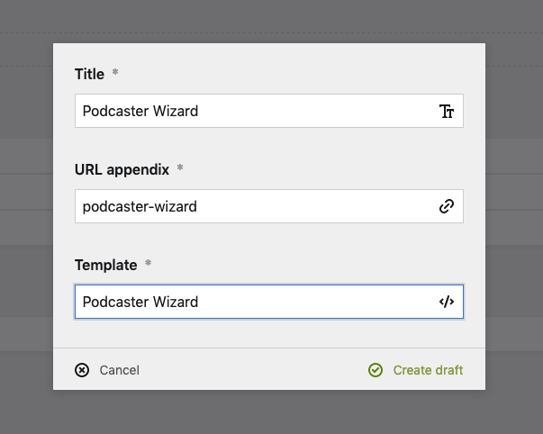
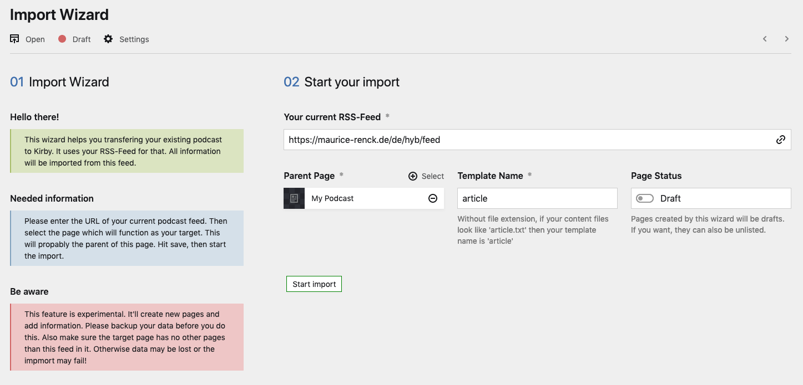

# Installation and import of an existing Podcast

The Podcaster plugin comes with an import wizard which enables you to transfer any existing Podcast to Kirby. You will still need to create all the blueprints and templates, but you don't need to create all the pages.

## Installation

Start by installing the plugin. You can install it in three different ways. It's recommended to use composer, but not needed.

- `composer require mauricerenck/podcaster`
- `git submodule add https://github.com/mauricerenck/kirby-podcaster.git site/plugins/podcaster`
- unzip [master.zip](https://github.com/mauricerenck/kirby-podcaster/releases/latest) as folder `site/plugins/podcaster`

## Importing your Podcast

In order to be able to import your existing Podcast, the rss feed must still be available. Please also open the [Blank install](docs/setup-clean.md) docs, as you will find more details on how to setup everything after your import is done.

In the panel create a new page for your podcast listing, this page will act as a parent for your feed and episodes.
Create another page, choose the Template `Podcaster Wizard`. Name it like you wish, we will delete it afterwards.

Open the newly created page.
Fill in the feed url of your existing podcast. Select the Podcast listing page you created before as the `Parent Page`. Type in the template filename you will use for your episodes. If your blueprint is called `episode.yml` just type in `episode` without any file extension.

Everything correct? Hit the `Start import` button. You will see some status messages. The wizard will try to parse your feed and get the needed information. It will then start parsing your episodes, create them as new pages, download the mp3 files and upload them to the panel! It will also create the base for your rss-feed.

** DO NOT CLOSE THE WINDOW!**

After everything is done, you can go the podcast listing page. You should see all your pages as drafts and also a new rss feed. You will need to adjust the feed. You can edit the episodes or just change their status to published. You can find more on the in the basic setup guide, also how to enable tracking how to adapt your templates and other features.

That's it! You're ready! Publish the page and change the feed url wherever you submitted it or redirect the old one to the new one.

We can now just delete the wizard page, we don't need it anymore.
